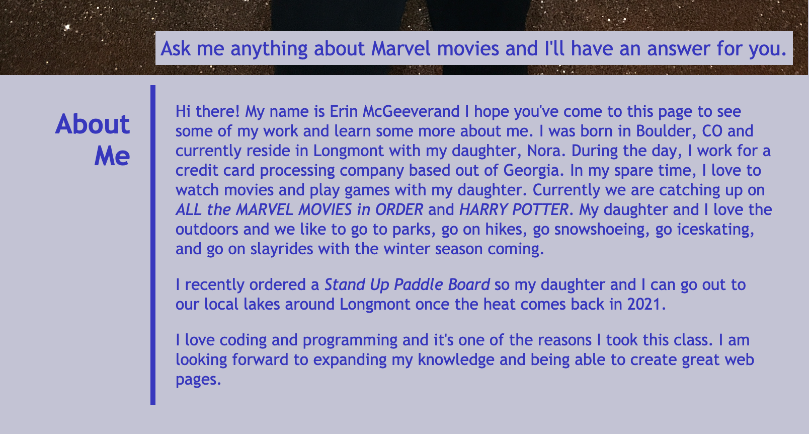
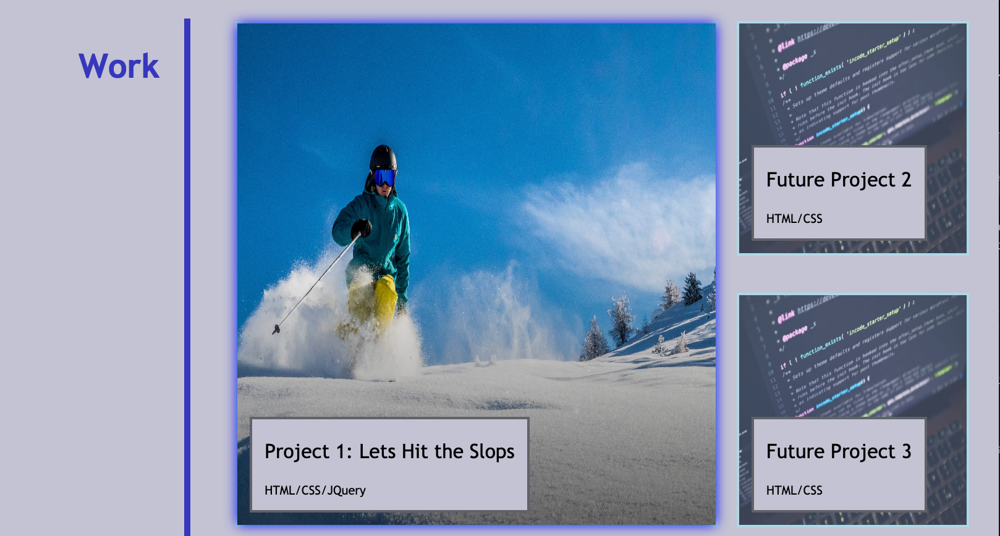
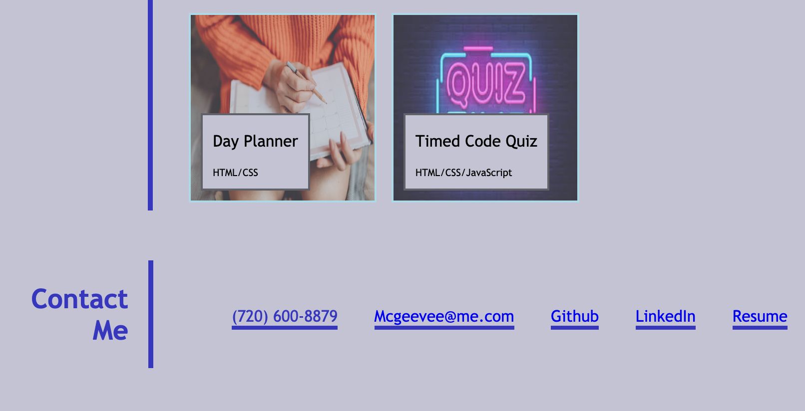

# Professional Portfolio 1
<h3>Description</h3>

 This is a professional profile showing a professional picture, a biography, my current location, my email address, a link to my portfolio on github, and 3 of my repositories that I wanted to highlight are on the page. 

<h3>Source Type </h3>

HTML

<h3>The Website</h3>

Here is the link to the <a href ="https://mcgeevee.github.io/Portfolio1" >website</a>

<h3>License</h3>

<a href="https://choosealicense.com/licenses/mit/#">MIT</a> License
